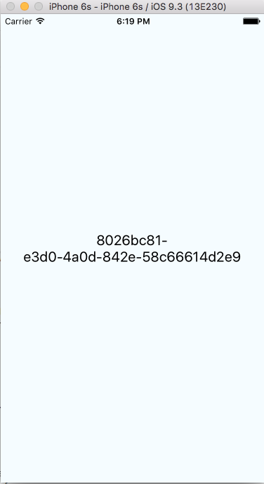
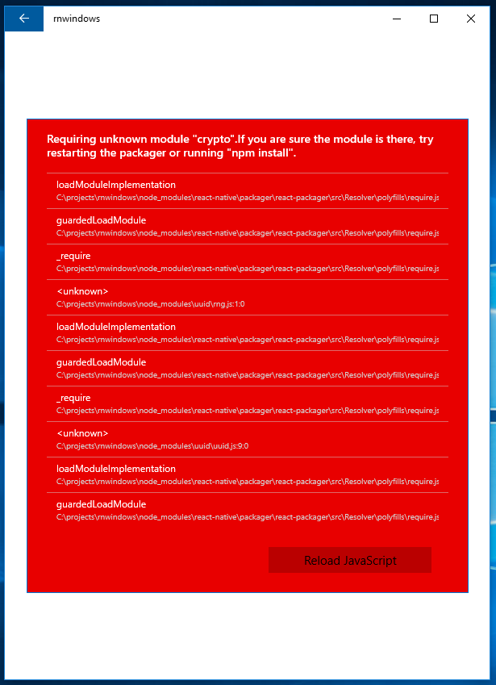

# React Native Windows Issue

## Crypto

This example simply downloads the NPM package 'uuid' and attempts to put a guid into a text block.
```javascript
var uuid = require('uuid');

class rnwindows extends Component {
  render() {
    return (
      <View style={styles.container}>
        <Text style={styles.welcome}>
          {uuid.v4()}
        </Text>        
      </View>
    );
  }
}
```

iSO Emulator



Windows Desktop


